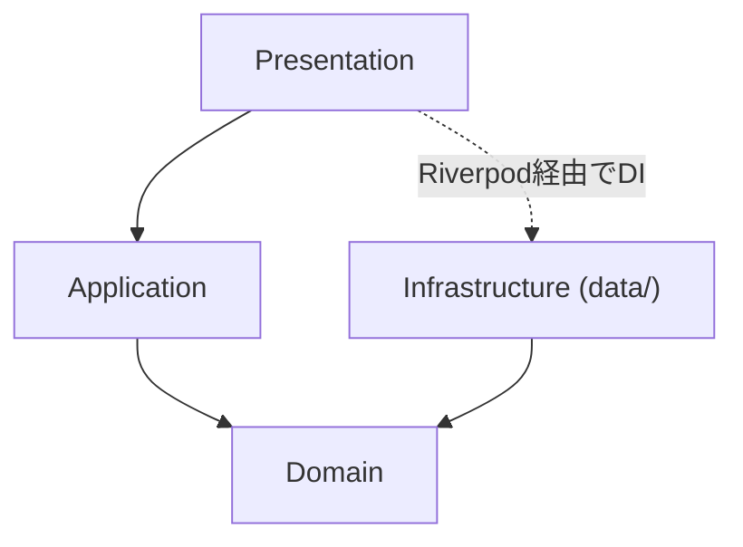
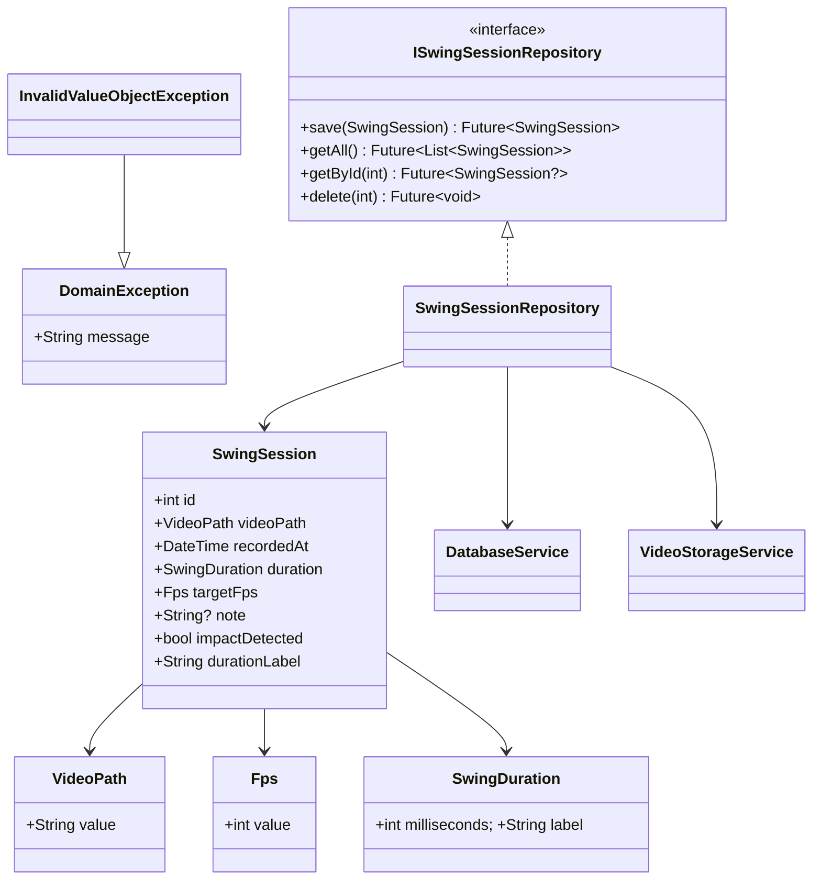
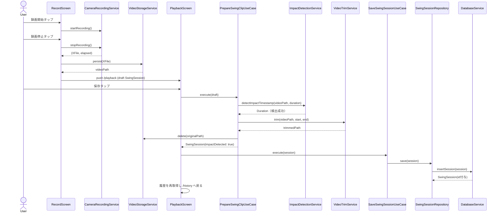
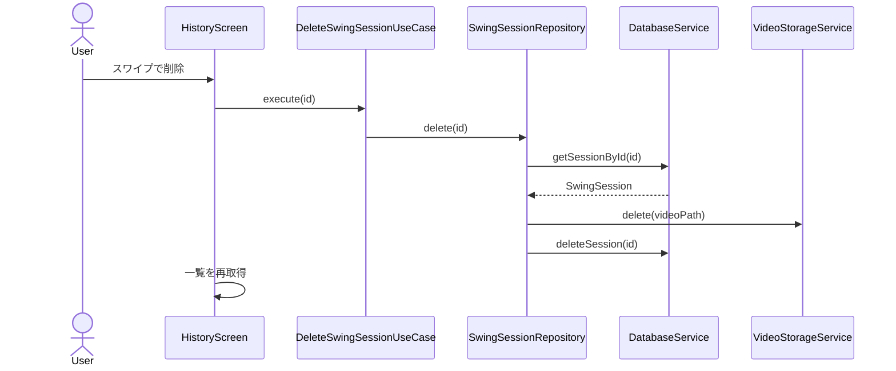

# 設計書（リバースエンジニアリング）

このドキュメントは現在の実装（2026年6月時点）からリバースで作成した設計書です。
個々の意思決定の背景は [docs/adr/](../adr/README.md) のADRを参照してください。本書はADRの内容を前提として、
システム全体の構造を一覧できるようにまとめたものです。

## 1. 概要

GolfSwingAnalyzerは、スマートフォンのカメラでゴルフスイングを録画し、再生・確認するためのFlutterアプリです。

主な機能は以下の3つです。

1. **スイング撮影**：背面カメラでスイングを録画する
2. **インパクト検出＋自動トリミング**：録画した動画の中心（ターゲットマーク）でボールが消えるタイミング（インパクト）を画像解析で推定し、その前後0.2秒だけを残してトリミングする。検出できなかった場合は元の動画をそのまま保存し、検出失敗であることを履歴画面に表示する
3. **履歴の再生・削除**：保存したスイングをコマ送り・スローモーションで確認し、不要なものを削除する

## 2. ディレクトリ構成

```text
lib/
├── main.dart                      # エントリポイント（ProviderScope初期化）
├── app.dart                       # MaterialApp.router・GoRouterルート定義
├── core/
│   └── theme/app_theme.dart       # テーマ定義
├── domain/                        # ドメイン層（Flutter/外部ライブラリ非依存）
│   ├── entities/
│   │   └── swing_session.dart     # SwingSession（@freezed）
│   ├── value_objects/
│   │   ├── video_path.dart        # VideoPath（非空保証）
│   │   ├── fps.dart                # Fps（正の値保証）
│   │   └── swing_duration.dart     # SwingDuration（非負保証・表示ラベル整形）
│   ├── repositories/
│   │   └── i_swing_session_repository.dart  # Repositoryインターフェース
│   └── exceptions/                # DomainException系
├── application/                   # アプリケーション層
│   ├── dtos/
│   │   └── playback_args.dart     # PlaybackArgs（@freezed）
│   └── use_cases/swing_session/
│       ├── save_swing_session_use_case.dart
│       ├── get_all_swing_sessions_use_case.dart
│       ├── get_swing_session_use_case.dart
│       ├── delete_swing_session_use_case.dart
│       └── prepare_swing_clip_use_case.dart   # インパクト検出＋トリミングの中核
├── data/                          # Infrastructure層（フォルダ名は data/ のまま運用）
│   ├── services/
│   │   ├── camera_recording_service.dart      # cameraプラグインのラッパー
│   │   ├── video_storage_service.dart         # 動画ファイルの永続化・削除
│   │   ├── impact_detection_service.dart      # ROIフレーム差分によるインパクト検出
│   │   ├── video_trim_service.dart            # easy_video_editorによるトリミング
│   │   └── database_service.dart              # sqfliteによるCRUD・Entity⇔Rowマッピング
│   └── repositories/
│       └── swing_session_repository.dart      # Repository実装
└── presentation/
    ├── providers/providers.dart   # Riverpod DIワイヤリング
    ├── screens/
    │   ├── record/record_screen.dart
    │   ├── playback/playback_screen.dart
    │   └── history/history_screen.dart
    └── widgets/
        ├── overhead_alignment_guide.dart
        └── swing_session_card.dart

test/
├── domain/value_objects/          # VideoPath / Fps / SwingDuration
├── domain/entities/                # SwingSession
├── application/use_cases/          # PrepareSwingClipUseCase
└── data/repositories/               # SwingSessionRepository
```

## 3. アーキテクチャ

[CLAUDE.md](../../CLAUDE.md) に基づくDDD構成。依存方向は一方向。



- Presentationは画面表示・ユーザー操作・状態監視のみを担当し、業務ロジックを持たない
- ApplicationはUseCase（1クラス1ユースケース）としてRepository/Serviceを呼び出す
- DomainはFlutter・外部ライブラリに依存しない（Entity・Value Object・Repositoryインターフェース・DomainException）
- Infrastructure（`data/`）はDomainが定義したRepositoryインターフェースを実装し、sqflite・ファイルI/O・cameraプラグイン等の外部依存をここに閉じ込める
- 状態管理はRiverpod。Providerは業務ロジックを持たず、UseCase/Serviceの生成・呼び出しのみを行う（`presentation/providers/providers.dart`）

## 4. ドメインモデル

### 4.1 SwingSession（Entity）

1回のスイング撮影を表すエンティティ。Freezedで不変（immutable）に実装。

| フィールド | 型 | 説明 |
|---|---|---|
| `id` | `int` | DB上のID（未保存時は`0`） |
| `videoPath` | `VideoPath` | 動画ファイルパス |
| `recordedAt` | `DateTime` | 撮影日時 |
| `duration` | `SwingDuration` | 再生時間 |
| `targetFps` | `Fps` | 目標フレームレート |
| `note` | `String?` | メモ（現状UIからは未使用、将来拡張用） |
| `impactDetected` | `bool` | インパクト検出に成功したか（デフォルト`true`） |

`durationLabel`ゲッターは`duration.label`に委譲し、`mm:ss.t`（100ミリ秒精度）形式の表示文字列を返す。

### 4.2 Value Object

ドメイン上意味のある不変条件を持つフィールドのみVO化している（`note`・`impactDetected`は単純な値のためVO化していない）。

| VO | ラップする型 | 不変条件 | 役割 |
|---|---|---|---|
| `VideoPath` | `String` | 非空 | 動画ファイルの場所を表す |
| `Fps` | `int` | `> 0` | フレームレート。`1000/fps`等の計算でのゼロ除算を防ぐ |
| `SwingDuration` | `int`（ミリ秒） | `>= 0` | 再生時間。`mm:ss.t`形式の表示ラベルを自分自身で持つ |

不変条件に違反した場合は`InvalidValueObjectException`（`DomainException`のサブクラス）をthrowする（`assert`ではなくリリースビルドでも有効な例外）。

### 4.3 Repository

```dart
abstract interface class ISwingSessionRepository {
  Future<SwingSession> save(SwingSession session);
  Future<List<SwingSession>> getAll();
  Future<SwingSession?> getById(int id);
  Future<void> delete(int id);
}
```

実装（`SwingSessionRepository`）は`DatabaseService`（DB行の永続化）と`VideoStorageService`（動画ファイルの削除）の両方を呼び出し、「DBから消す」「ファイルも消す」の整合性をRepository層で保証する。

### 4.4 DomainException階層

```text
DomainException（abstract）
├── CameraInitializationException   カメラ初期化失敗
├── RecordingFailedException        録画開始/停止/トリミング失敗
├── SwingSessionNotFoundException   指定IDのセッションが存在しない
└── InvalidValueObjectException     Value Objectの不変条件違反
```

### 4.5 クラス図



## 5. ユースケース一覧

| UseCase | 役割 | 備考 |
|---|---|---|
| `SaveSwingSessionUseCase` | セッションを保存 | Repositoryへの単純委譲 |
| `GetAllSwingSessionsUseCase` | 全セッション取得（履歴一覧用） | Repositoryへの単純委譲 |
| `GetSwingSessionUseCase` | IDで1件取得 | 存在しない場合`SwingSessionNotFoundException` |
| `DeleteSwingSessionUseCase` | IDで削除 | Repositoryへの単純委譲（DB行＋動画ファイル削除） |
| `PrepareSwingClipUseCase` | インパクト検出＋トリミング | 唯一ロジックを持つUseCase。詳細は5.1 |

### 5.1 PrepareSwingClipUseCase（中核ロジック）

撮影直後のドラフト`SwingSession`を受け取り、インパクト（ボールが消えた瞬間）を検出できた場合はその前後0.2秒だけを残した動画にトリミングする。検出できなかった場合は元の動画のまま`impactDetected: false`を付けて返す。

```dart
static const _clipMargin = Duration(milliseconds: 200);

Future<SwingSession> execute(SwingSession draft) async {
  final impactAt = await _impactDetection.detectImpactTimestamp(...);
  if (impactAt == null) {
    return draft.copyWith(impactDetected: false);   // フォールバック
  }
  // start = impactAt - 200ms（0未満はクランプ）
  // end   = impactAt + 200ms（動画長を超える場合はクランプ）
  final trimmedPath = await _videoTrim.trim(...);
  await _videoStorage.delete(draft.videoPath.value);  // 元ファイルは削除
  return draft.copyWith(videoPath: ..., duration: ..., impactDetected: true);
}
```

依存先（`ImpactDetectionService` / `VideoTrimService` / `VideoStorageService`）はInfrastructure層のサービスで、VOではなく`String`/`Duration`のプリミティブ型をそのまま受け渡す（境界でのunwrap方針。3.のアーキテクチャ節参照）。

## 6. シーケンス図

### 6.1 撮影 → 保存（インパクト検出 成功パターン）



検出失敗時は `ImpactDetectionService` が `null` を返し、`PrepareSwingClipUseCase` はトリミングを行わず `impactDetected: false` のまま元動画を保存する（トリム・削除の呼び出し自体が発生しない）。

### 6.2 インパクト検出アルゴリズム（粗→密の2段階走査）

```mermaid
flowchart TD
    A[t=0でROI色を取得しbaselineとする] --> B[coarseIntervalMs(300ms)刻みで走査]
    B --> C{baselineとの差がしきい値(30.0)を2回連続で超えたか}
    C -- No --> D[走査終了まで継続] --> E[検出できず: impactDetected=false]
    C -- Yes --> F[直前の粗い区間内をfineIntervalMs(33ms)刻みで再走査]
    F --> G[しきい値を最初に超えた時刻を厳密なインパクト時刻とする]
    G --> H[±200msでトリミング: impactDetected=true]
```

ROIは`OverheadAlignmentGuide`のクロスヘアと同じ位置（プレビュー中央、短辺の12%の円）。実機検証で1回のネイティブサムネイル抽出に約300〜400ms掛かることが判明したため、全区間を33ms刻みで走査せず、粗い間隔で候補区間を絞ったあとその区間だけ精密に再走査する2段階方式を採用している。

### 6.3 履歴からの削除



## 7. 画面・ナビゲーション構成

GoRouterの`StatefulShellRoute.indexedStack`で「撮影」「履歴」をボトムナビゲーションのタブとして保持し、再生画面はその外側にプッシュする。

```text
/record    （撮影タブ・初期画面） ─┐
/history   （履歴タブ）           ─┴─ ボトムナビゲーションで切り替え（状態保持）
/playback  （再生画面、extra: PlaybackArgs）─ record/historyどちらからもpushされる
```

`PlaybackArgs.isFreshRecording`で「撮影直後のレビュー」と「履歴からの再生」の2モードを切り替える。

### 7.1 スイングレビュー画面の削除操作

削除ボタンは再生・速度選択などの操作ボタン群から離し、AppBarのタイトル右側に「削除」のテキストアクションとして配置する（誤操作防止。[Issue #1](https://github.com/aaandou/GolfSwingAnalyzer/issues/1)）。タップすると確認ダイアログ（キャンセル／削除）を表示し、確定後にのみ削除を実行する。

| モード | AppBarの「削除」タップ後の確認文言 | 確定後の処理 | ボトム領域 |
|---|---|---|---|
| `isFreshRecording: true` | 「この録画を削除しますか？」 | `_discard()`（未保存の動画ファイルのみ削除） | 「保存」ボタンのみ（全幅） |
| `isFreshRecording: false` | 「このスイングを削除しますか？元に戻せません。」 | `_delete()`（DB行＋動画ファイルを削除） | ボタンなし |

確認ダイアログの文言選択は`deleteConfirmationMessage()`という純粋関数に切り出し、Widgetツリーをpumpしなくても単体テストできるようにしている。`_isProcessing`（インパクト検出・トリミング中）の間はAppBarの削除アクションも無効化し、処理中の動画が消えないようにする。

## 8. 永続化

- **動画ファイル**：アプリのドキュメントディレクトリ配下 `swings/` に `swing_<timestamp>.mp4` として保存（`VideoStorageService`）
- **メタデータ**：sqflite（`golf_swing_analyzer.db`、テーブル`swing_sessions`）

```sql
CREATE TABLE swing_sessions (
  id INTEGER PRIMARY KEY AUTOINCREMENT,
  videoPath TEXT NOT NULL,
  recordedAt TEXT NOT NULL,
  durationMs INTEGER NOT NULL,
  targetFps INTEGER NOT NULL,
  note TEXT,
  impactDetected INTEGER NOT NULL DEFAULT 1
)
```

スキーマバージョンは2（v1→v2で`impactDetected`列を追加、`onUpgrade`でマイグレーション）。Entity↔Row変換は`DatabaseService._toRow`/`_fromRow`がVOのwrap/unwrapも含めて一括して担う。

## 9. テスト方針

CLAUDE.mdの優先順位（Domain > UseCase > Repository、Widgetテストは必要な場合のみ）に従う。

| 対象 | テスト内容 |
|---|---|
| `VideoPath` / `Fps` / `SwingDuration` | 不変条件の検証、等価性、`SwingDuration.label`の実機検証済み境界値（`00:00.4`/`00:03.5`/`00:19.5`等）を固定化 |
| `SwingSession` | `copyWith`・等価性のVO合成サニティチェック |
| `PrepareSwingClipUseCase` | 検出成功時のトリム呼び出し・検出失敗時のフォールバック・トリム窓のクランプ（手書きFakeで`ImpactDetectionService`/`VideoTrimService`/`VideoStorageService`を代替） |
| `SwingSessionRepository` | `delete`がDB行と動画ファイルの両方を消すこと |

モックライブラリ（mocktail等）や`sqflite_common_ffi`は導入せず、依存の少ない手書きFakeで代替している（既存依存方針との一貫性を優先）。

## 10. 関連ドキュメント

- [docs/adr/ADR-001-riverpod-state-management.md](../adr/ADR-001-riverpod-state-management.md)
- [docs/adr/ADR-002-gorouter-navigation.md](../adr/ADR-002-gorouter-navigation.md)
- [docs/adr/ADR-003-sqflite-and-filesystem-persistence.md](../adr/ADR-003-sqflite-and-filesystem-persistence.md)
- [docs/adr/ADR-004-camera-plugin-best-effort-fps-and-playback-slowmo.md](../adr/ADR-004-camera-plugin-best-effort-fps-and-playback-slowmo.md)
- [CLAUDE.md](../../CLAUDE.md)
